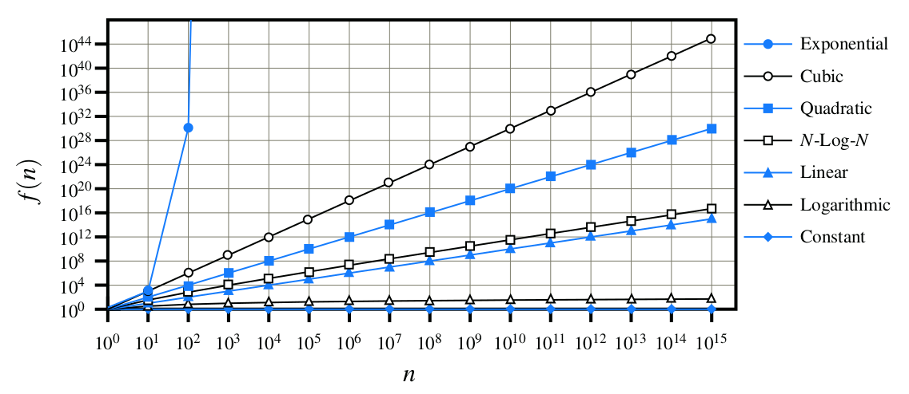
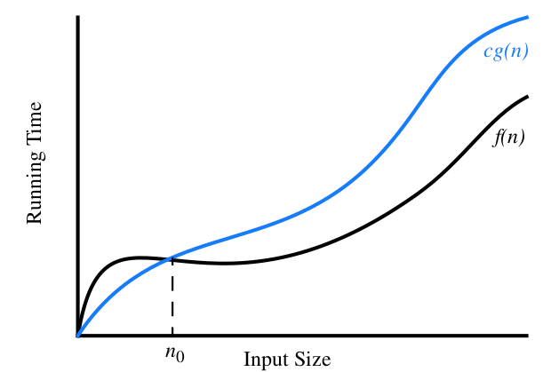

# Algorithm Analysis

* **data structure**: systematic way of organizing and accessing data
* **algorithm**: step-by-step procedure for performing some task in a finite amount of time

The primary analysis tool used in context of this project involves characterizing the **running 
times** of algorithms and data structure operations, with **space usage** also being of interest.

We focus on the relationship between the running time of an algorithm and the size of its input.

We are interested in characterizing an algorithm's running time as a function of the input size.

## Empirical Analysis

Measure the elapsed time, collect data, and compare:

    long startTime = System.currentTimeMillis();
    // (run the algorithm)
    long endTime = System.currentTimeMillis();
    long elapsed = endTime - startTime;

#### Challenges of Experimental Analysis

* Experimental running times of two algorithms are difficult to directly compare unless the 
  experiments are performed in the same hardware and software environments.
* Experiments can be done only on a limited set of test inputs; hence, they leave out the 
  running times of inputs not included in the experiment (and these inputs may be important).
* An algorithm must be fully implemented in order to execute it to study its running time 
  experimentally.

### Moving Beyond Experimental Analysis

Our goal is to develop an approach to analyzing the efficiency of algorithms that:

1. Allows us to evaluate the relative efficiency of any two algorithms in a way that is 
   independent of the hardware and software environment.
2. Is performed by studying a high-level description of the algorithm without need for 
   implementation.
3. Takes into account all possible inputs.

#### Counting Primitive Operations

We define a set of primitive operations such as the following:

* Assigning a value to a variable 
* Following an object reference 
* Performing an arithmetic operation (for example, adding two numbers)
* Comparing two numbers 
* Accessing a single element of an array by index 
* Calling a method 
* Returning from a method

A primitive operation corresponds to a low-level instruction with an execution time that is 
constant. We will simply count how many primitive operations are executed, and use this number **t** 
as a measure of the running time of the algorithm. The number, **t**, of primitive operations an 
algorithm performs will be proportional to the actual running time of that algorithm.

#### Measuring Operations as a Function of Input Size

To capture the order of growth of an algorithm's running time, we will associate, with each 
algorithm, a function **f(n)** that characterizes the number of primitive operations that are 
performed as a function of the input size **n**.

#### Focusing on the Worst-Case Input

An average-case analysis usually requires that we calculate expected running times based on a 
given input distribution, which usually involves sophisticated probability theory. Therefore, 
unless we specify otherwise, we will characterize running times in terms of the **worst case**, 
as a function of the input size, **n**, of the algorithm.

## Common Mathematical Functions

### The Constant Function

    f(n) = c

For any argument **n**, the constant function **f(n)** assigns the value **c**.

The most fundamental constant function is 

    g(n) = 1

### The Logarithm Function

This function is defined as the inverse of a power, as follows:

    x = log_b n <=> b^x = n

The base 2 is so common, so that is

    log n = log_2 n

**Logarithm Rules:**

    log_b (ac) = log_b a + log_b c
    log_b (a/c) = log_b a - log_b c
    log_b (a^c) = c log_b a
    log_b a = log_d a / log_d b
    b^(log_d a) = a^(log_d b)

### The Linear Function

    f(n) = n

This function arises in algorithm analysis any time we have to do a single basic operation for 
each of **n** elements.

### The N-Log-N Function

    f(n) = n log_n

that is, the function that assigns to an input **n** the value of **n** times the logarithm 
base-two of **n**. This function grows a little more rapidly than the linear function and a lot 
less rapidly than the quadratic function.

### The Quadratic Function

    f(n) = n^2

That is, given an input value **n**, the function **f** assigns the product of **n** with itself 
(in other words, "**n squared**"). The main reason why the quadratic function appears in the 
analysis of algorithms is that there are many algorithms that have **nested loops**, where the inner
loop performs a linear number of operations and the outer loop is performed a
linear number of times.

**Nested Loops and the Quadratic Function**

    1 + 2 + 3 + ... + (n-2) + (n-1) + n = (n(n+1))/2

See story of **Gauss** as pupil, solving the task of adding all numbers from 1 to 100 in very 
little time.

### The Cubic Function and Other Polynomials

    f(n) = n^3

which assigns to an input value **n** the product of **n** with itself three times.

**Polynomials**

The linear, quadratic and cubic functions can each be viewed as being part of a
larger class of functions, the polynomials. A polynomial function has the form,

    f(n) = a_0 + a_1 n + a_2 n^2 + a_3 n^3 + ... + a_d n^d

where _a0, a1, ..., ad_ are constants, called the **coefficients** of the polynomial, and 
_a_d != 0_. Integer _d_, which indicates the highest power in the polynomial, is called  the 
**degree** of the polynomial.

**Summations**

A notation that appears again and again in the analysis of data structures and algorithms is the **summation**, which is defined as follows:

    b∑_i=a f(i) = f(a) + f(a+1) + f(a+2) + ... + f(b)

### The Exponential Function

    f(n) = b^n

That is, function **f(n)** assigns to the input argument **n** the value obtained by multiplying 
the base **b** by itself **n** times. As was the case with the logarithm function, the most 
common base for the exponential function in algorithm analysis is **b=2**.

**Exponent Rules**

    (b^a)^c = b^(ac)
    b^a b^c = b^(a+c)
    b^a/b^c = b^(a-c)

**Geometric Sums**

Suppose we have a loop for which each iteration takes a multiplicative factor longer than the 
previous one. This loop can be analyzed using the following proposition.

For any integer **n >= 0** and any real number a such that **a > 0** and **a != 1**, consider the 
summation:

    n∑_i=0 ai = 1 + a + *2 + ... + a^n

### Comparing Growth Rates

## Asymptotic Analysis

In algorithm analysis, we focus on the growth rate of the running time as a function of the
input size **n**, taking a "big-picture" approach. For example, it is often enough just to know
that the running time of an algorithm **grows proportionally** to **n**.

We analyze algorithms using a mathematical notation for functions that disregards constant
factors. Namely, we characterize the running times of algorithms by using functions that map the
size of the input, **n**, to values that correspond to the main factor that determines the
growth rate in terms of **n**. This approach reflects that each basic step in a pseudocode
description or a high-level language implementation may correspond to a small number of
primitive operations. Thus, we can perform an analysis of an algorithm by estimating the number
of primitive operations executed up to a constant factor, rather than getting bogged down in
language-specific or hardware-specific analysis of the exact number of operations that execute
on the computer.

### The "Big-O" Notation

Let **f(n)** and **g(n)** be functions mapping positive integers to positive real numbers. We
say that **f(n)** is **O(g(n))** if there is a real constant **c > 0** and an integer constant
**n_0 >= 1** such that

    f(n) <= c g(n), for n >= n_0

**Example**

    8n + 6 is O(n)

**Justification**

By the big-Oh definition, we **need to find a real constant c > 0 and an integer constant n0 ≥ 1 
such that 8n + 5 <= cn for every integer n >= n_0**.
It is easy to see that a possible choice is c = 9 and n_0 = 5. Indeed, this is one of infinitely 
many choices available because there is a trade-off between c and n_0 . For example, we could 
rely on constants c = 13 and n0 = 1.

#### Some Properties of the Big-Oh Notation

The big-Oh notation allows us to ignore constant factors and lower-order terms and focus on the
main components of a function that affect its growth.

**Example**

    5n^4 + 3n^3 + 2n^2 + 4n + 1 = O(n^4)

**Justification**: Note that

    5n^4 + 3n^3 + 2n^2 + 4n + 1 <= (5 + 3 + 2 + 4 + 1)n^4 = cn^4, for c = 15, when n >= n_0 = 1

Thus, the highest-degree term in a polynomial is the term that determines the asymptotic growth 
rate of that polynomial.

**Further Examples**

    5 n^2 + 3n log n + 2n + 5 is O(n^2)
    20n^3 + 10n log n + 5 is O(n^3)
    3 log n + 2 is O(log n)
    2^(n+2) is O(2^n)
    2n + 100 log n

#### Characterizing Functions in Simplest Terms

While it is true that the function **f(n) = 4n^3 + 3n^2** is **O(n^5)** or even **O(n^4)**, it 
is more accurate to say that f(n) is O(n^3).

**It is also considered poor taste to include constant factors and lower-order terms in the big-Oh 
notation**. For example, it is not fashionable to say that the function **2n^2** is 
**O(4n^2 + 6n log n)**, although this is completely correct. We should strive instead to 
describe the function in the big-Oh in **simplest terms**.

The seven functions above are the most common functions used in conjunction with the big-Oh 
notation to characterize the running times and space usage of algorithms. Indeed, we typically 
use the names of these functions to refer to the running times of the algorithms they 
characterize. So, for example, we would say that an algorithm that runs in worst-case time 
**4n^2 + n log n** is a **quadratic-time** algorithm, since it runs in **O(n^2)** time. Likewise, 
an algorithm running in time at most **5n + 20 log n + 4** would be called a **linear-time**
algorithm.

**Drop the Constants**

    O(2n) -> O(n)

**Drop the Non-Dominant Terms**

    O(n^2 + n) -> O(n^2)
    O(n + log n) -> O(n)
    O(5 * 2^n + 1000n^100) -> O(2^n)
