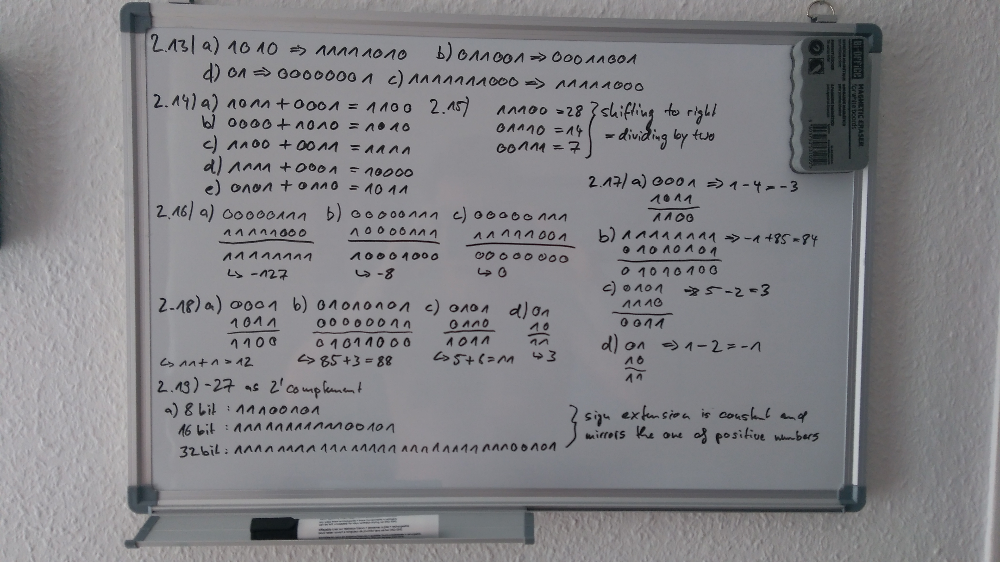
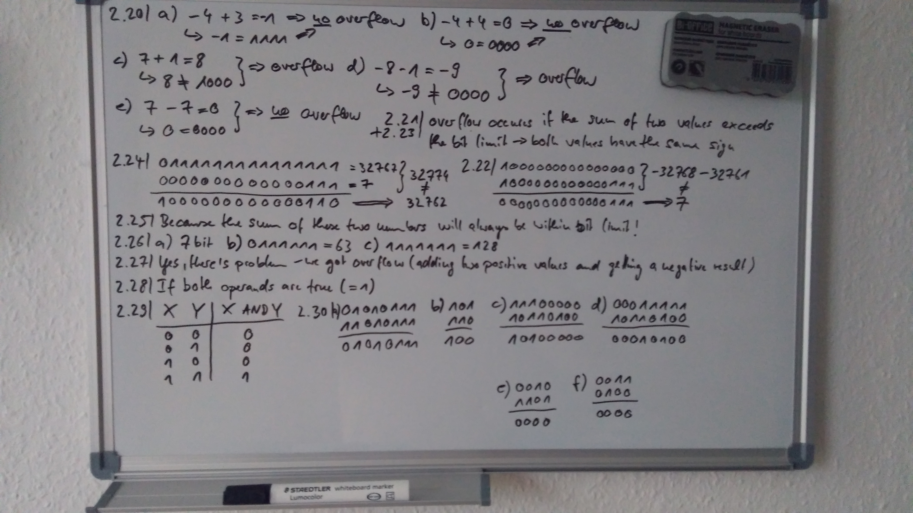
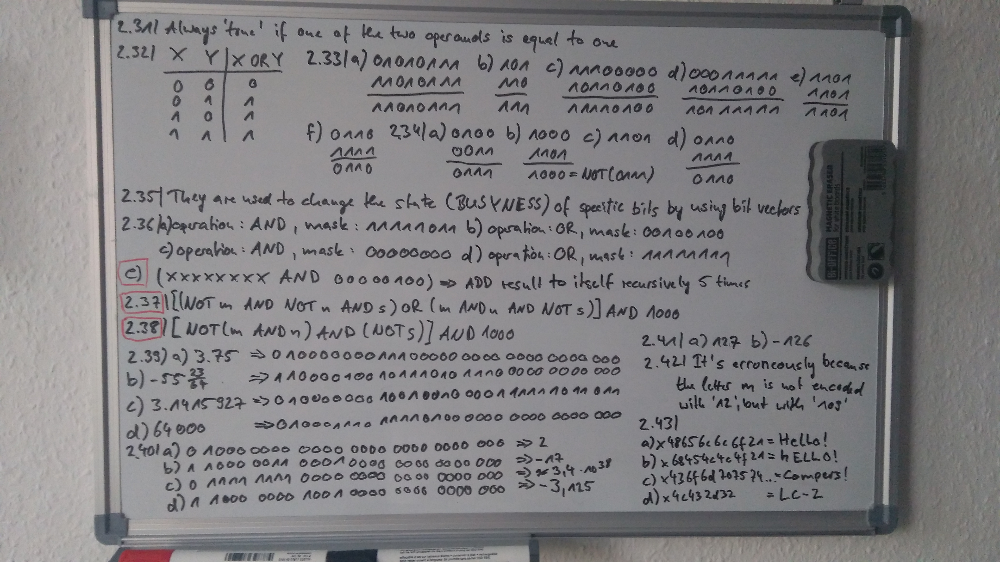
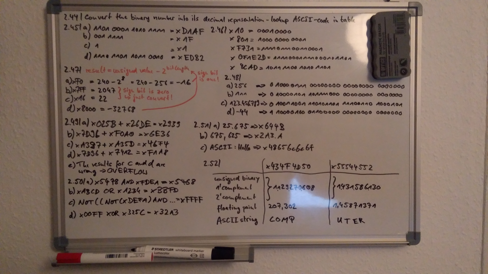

# 2 Bits, Data Types, and Operations

### 2.1 Given n bits, how many distinct combinations of the n bits exist?

2^n

### 2.2 There are 26 characters in the alphabet we use for writing English. What is the least number of bits needed to give each character a unique bit pattern? How many bits would we need to distinguish between upper and lowercase versions of all 26 characters?

We need 5 bits for the alphabet. If we want to distinguish between upper and lowercase version of the letters we need 6
bits.

### 2.3 a.) Assume that there are about 400 students in your class. If every student is to be assigned a unique bit pattern, what is the minimum number of bits required to do this?

9 bits

### 2.3 b.) How many more students can be admitted to the class without requiring additional bits for each student's unique bit pattern?

112

### 2.4 Given n bits, how many unsigned integers can be represented with the n bits? What is the range of these integers?

2^(k-1) -1

### 2.5 Using 5 bits to represent each number, write the representations of 7 and —7 in 1's complement, signed magnitude, and 2's complement integers.

* **bit representation of 7:** 00111
* **Signed magnitude:** 10111
* **1's complement:** 11000
* **2's complement:** 11001

**Note**: A shortcut for figuring out the representation for - A(A != 0), if we know the representation for A, is as
follows: Flip all the bits of A (the term for "flip" is complement), and add 1 to the complement of A. The sum of A and
the complement of A is 11111. If we then add 00001 to 11111, the final result is 00000. Thus, the representation for —A
can be easily obtained by adding 1 to the complement of A.

### 2.6 Write the 6-bit 2's complement representation of —32.

* **bit representation of 32:** 100000
* **1's complement:** 011111
* **2's complement:** 100000

### 2.7 Create a table showing the decimal values of all 4-bit 2's complement numbers.

| Representation |            Value |     Represent- | tation         |
|----------------|-----------------:|---------------:|----------------|
|                | Signed Magnitude | 1's Complement | 2's Complement |
| 0000           | 0                | 0              | 0              |
| 0001           | 1                | 1              | 1              |
| 0010           | 2                | 2              | 2              |
| 0011           | 3                | 3              | 3              |
| 0100           | 4                | 4              | 4              |
| 0101           | 5                | 5              | 5              |
| 0110           | 6                | 6              | 6              |
| 0111           | 7                | 7              | 7              |
| 1000           | -0               | -7             | -8             |
| 1001           | -1               | -6             | -7             |
| 1010           | -2               | -5             | -6             |
| 1011           | -3               | -4             | -5             |
| 1100           | -4               | -3             | -4             |
| 1101           | -5               | -2             | -3             |
| 1110           | -6               | -1             | -2             |
| 1111           | -7               | 0              | -1             |

### 2.8 a.) What is the largest positive number one can represent in an 8-bit 2's complement code? Write your result in binary and decimal.

* **Note**: formula for that delivered in 2.4 and 2.8 c.
* => 2^(n-1) -1 = 2^7 -1 = 127

### 2.8 b.) What is the greatest magnitude negative number one can represent in an 8-bit 2's complement code? Write your result in binary and decimal.

* -128

### 2.8 c.) What is the largest positive number one can represent in n-bit 2's complement code?

2^(n-1) -1

### 2.8 d.) What is the greatest magnitude negative number one can represent in n-bit 2's complement code?

2^(n-1) x -1

### 2.9 How many bits are needed to represent Avogadro's number (6.02 x 1023) in 2's complement binary representation?

### 2.10 Convert the following 2's complement binary numbers to decimal.

* **a.** 1010
* **b.** 01011010
* **c.** 11111110
* **d.** 0011100111010011

### 2.11 Convert these decimal numbers to 8-bit 2's complement binary numbers.

* **a.** 102
* **b.** 64
* **c.** 33
* **d.** - 128
* **e.** 127

### 2.12 If the last digit of a 2's complement binary number is 0, then the number is even. If the last two digits of a 2's complement binary number are 00 (e.g., the binary number 01100), what does that tell you about the number?

### 2.13 Without changing their values, convert the following 2's complement binary numbers into 8-bit 2's complement numbers.

* **a.** 1010
* **b.** 011001
* **c.** 1111111000
* **d.** 01

### 2.14 Add the following bit patterns. Leave your results in binary form.

* **a.** 1011 + 0001
* **b.** 0000 + 1010
* **c.** 1100 + 0011
* **d.** 0101 + 0110
* **e.** 1111 + 0001

### 2.15 It was demonstrated in Example 2.5 that shifting a binary number one bit to the left is equivalent to multiplying the number by 2. What operation is performed when a binary number is shifted one bit to the right?

### 2.16 Write the results of the following additions as both 8-bit binary and decimal numbers. For each part, use standard binary addition as described in Section 2.5.1.

* **a.** Add the 1 's complement representation of 7 to the 1 's complement representation of —7.
* **b.** Add the signed magnitude representation of 7 to the signed magnitude representation of —7.
* **c.** Add the 2's complement representation of 7 to the 2's complement representation of —7.

### 2.17 Add the following 2's complement binary numbers. Also express the answer in decimal.

* **a.** 01 + 1011
* **b.** 11 + 01010101
* **c.** 0101 + 110
* **d.** 01 + 10

### 2.18 Add the following unsigned binary numbers. Also, express the answer in decimal.

* **a.** 01 + 1011
* **b.** 11 + 01010101
* **c.** 0101 + 110
* **d.** 01 + 10

### 2.19 Express the negative value —27 as a 2's complement integer, using eight bits. Repeat, using 16 bits. Repeat, using 32 bits. What does this illustrate with respect to the properties of sign extension as they pertain to 2's complement representation?

### 2.20 The following binary numbers are 4-bit 2's complement binary numbers. Which of the following operations generate overflow? Justify your answer by translating the operands and results into decimal.

* **a.** 1100 + 0011
* **b.** 1100 + 0100
* **c.** 0111 + 0001
* **d.** 1000 - 0001
* **e.** 0111 + 1001

### 2.21 Describe what conditions indicate overflow has occurred when two 2's complement numbers are added.

### 2.22 Create two 16-bit 2's complement integers such that their sum causes an overflow.

### 2.23 Describe what conditions indicate overflow has occurred when two unsigned numbers are added.

### 2.24 Create two 16-bit unsigned integers such that their sum causes an overflow.

### 2.25 Why does the sum of a negative 2's complement number and a positive 2's complement number never generate an overflow?

### 2.26 You wish to express - 6 4 as a 2's complement number.

* **a.** How many bits do you need (the minimum number)?
* **b.** With this number of bits, what is the largest positive number you can represent? (Please give answer in both
  decimal and binary).
* **c.** With this number of bits, what is the largest unsigned number you can represent? (Please give answer in both
  decimal and binary).

### 2.27 The LC-3, a 16-bit machine adds the two 2's complement numbers 0101010101010101 and 0011100111001111, producing 1000111100100100. Is there a problem here? If yes, what is the problem? If no, why not?

### 2.28 When is the output of an AND operation equal to 1?

### 2.29 Fill in the following truth table for a one-bit AND operation.

| X | Y | A AND Y |
|---|---|---------|
| 0 | 0 |         |
| 0 | 1 |         |
| 1 | 0 |         |
| 1 | 1 |         |

### 2.30 Compute the following. Write your results in binary.

* **a.** 0 1 0 1 0 1 1 1 AND 1 1 0 1 0 1 11
* **b.** 1 0 1 AND 110
* **c.** 1 1 1 0 0 0 0 0 AND 10110100
* **d.** 0 0 0 1 1 1 1 1 AND 10110100
* **e.** ( 0 0 1 1 AND 0110) AND 1101
* **f.** 0011 AND (0110 AND 1101)

### 2.44 What operation(s) can be used to convert the binary representation for 3 (i.e., 0000 0011) into the ASCII representation for 3 (i.e., 0011 0011)? What about the binary 4 into the ASCII 4? What about any digit?

### 2.45 Convert the following unsigned binary numbers to hexadecimal.

* **a.** 1101 0001 1010 1111
* **b.** 001 1111
* **c.** 1
* **d.** 1110 1101 1011 0010

### 2.46 Convert the following hexadecimal numbers to binary.

* **a.** xlO
* **b.** x801
* **c.** xF731
* **d.** X0F1E2D
* **e.** xBCAD

### 2.47 Convert the following hexadecimal representations of 2's complement binary numbers to decimal numbers.

* **a.** xFO
* **b.** x7FF
* **c.** xl6
* **d.** x8000

### 2.48 Convert the following decimal numbers to hexadecimal representations of 2's, complement numbers.

* **a.** 256
* **b.** I ll
* **c.** 123,456,789
* **d.** -44

### 2.49 Perform the following additions. The corresponding 16-bit binary numbers are in 2's complement notation. Provide your answers in hexadecimal.

* **a.** x025B + x26DE
* **b.** x7D96 + xFOAO
* **c.** xA397 + xA35D
* **d.** x7D96 + x7412
* **e.** What else can you say about the answers to parts c and dl

### 2.50 Perform the following logical operations. Express your answers in hexadecimal notation.

* **a.** x5478 AND xFDEA
* **b.** xABCD OR xl234
* **c.** NOT((NOT(xDEFA)) AND (NOT(xFFFF)))
* **d.** xOOFF XOR x325C

### 2.51 What is the hexadecimal representation of the following numbers?

* **a.** 25,675
* **b.** 675.625 (that is, 675|), in the IEEE 754 floating point standard
* **c.** The ASCII string: Hello

### 2.52 Consider two hexadecimal numbers: x434F4D50 and x55544552. What values do they represent for each of the five data types shown?

|                         | X434F4D50 | X55544552 |
|-------------------------|-----------|-----------|
| Unsigned binary         |           |           |
| 1 's complement         |           |           |
| 2's complement          |           |           |
| IEEE 754 floating point |           |           |
| ASCII string            |           |           |

### 2.53 Fill in the truth table for the equations given. The first line is done as an example.

* Qi = NOT(A AND B)
* Q2 = NOT(NOT(A) AND NOT(B))

| A | B | Q_1 | Q_2 |
|---|---|-----|-----|
| 0 | 0 | 1   | 0   |
|   |   |     |     |
|   |   |     |     |
|   |   |     |     |
|   |   |     |     |
|   |   |     |     |

Express Q2 another way.

### 2.54 Fill in the truth table for the equations given. The first line is done as an example.

* Q i = NOT(NOT(X) OR (X AND Y AND Z))
* Q2 = NOT((Y OR Z) AND (X AND Y AND Z))

| X | Y | Z | Q_1 | Q_2 |
|---|---|---|-----|-----|
| 0 | 0 | 0 | 0   | 1   |
|   |   |   |     |     |
|   |   |   |     |     |
|   |   |   |     |     |
|   |   |   |     |     |
|   |   |   |     |     |

### 2.55 We have represented numbers in base-2 (binary) and in base-16 (hex). We are now ready for unsigned base-4, which we will call quad numbers. A quad digit can be 0, 1, 2, or 3.

* **a.** What is the maximum unsigned decimal value that one can represent with 3 quad digits?
* **b.** What is the maximum unsigned decimal value that one can represent with n quad digits (Hint: your answer should
  be a function of n)l
* **c.** Add the two unsigned quad numbers: 023 and 221.
* **d.** What is the quad representation of the decimal number 42?
* **e.** What is the binary representation of the unsigned quad number 123.3?
* **f .** Express the unsigned quad number 123.3 in IEEE floating point format.
* **g.** Given a black box which takes m quad digits as input and produces one quad digit for output, what is the
  maximum number of unique functions this black box can implement?

### 2.56 Define a new 8-bit floating point format with 1 sign bit, 4 bits of exponent, using an excess-7 code (that is, the bias is 7), and 3 bits of fraction. If xE5 is the bit pattern for a number in this 8-bit floating point format, what value does it have? (Express as a decimal number.)